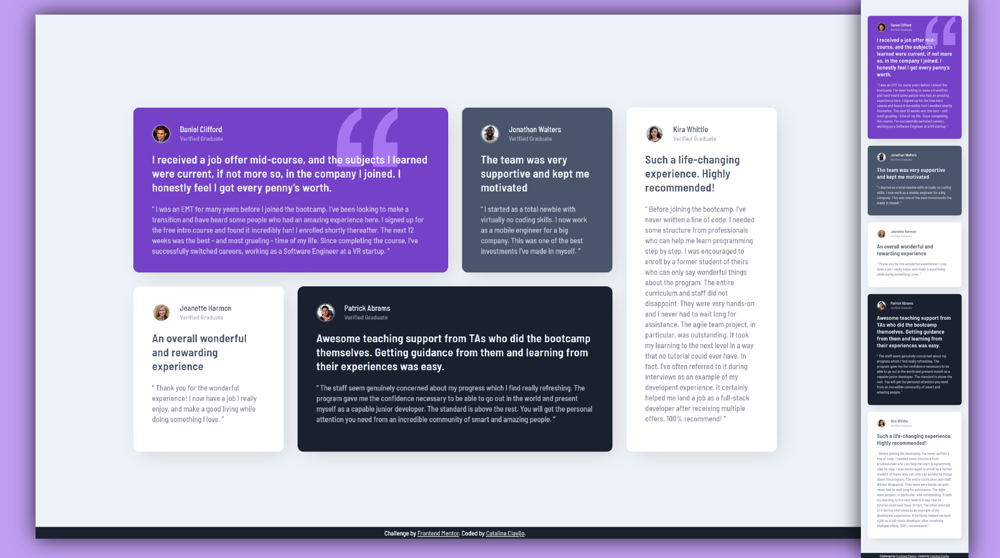

# Frontend Mentor - Testimonials grid section

This is a solution to the [Testimonials grid section challenge on Frontend Mentor](https://www.frontendmentor.io/challenges/testimonials-grid-section-Nnw6J7Un7).

## Screenshot

### Links

- Live Site URL: [https://cataclas.github.io/Frontend-Mentor_Testimonials-grid-section/](https://cataclas.github.io/Frontend-Mentor_Testimonials-grid-section/)

## Built with

- Semantic HTML5 markup
- [CSS custom properties](https://devdocs.io/css/)
- [Grid](https://devdocs.io/css/grid)
- [@media](https://devdocs.io/css/@media)
 

## Author

- Frontend Mentor - [@Cataclas](https://www.frontendmentor.io/profile/Cataclas)
